# TrendToTweet MCP Server - Architecture

## Why We Built a Local MCP Server

### The Problem
We tried several existing Twitter MCP solutions:

1. **Smithery Twitter MCP** - OAuth issues, account suspension problems
2. **Composio** - API v3 migration issues, CLI broken
3. **rafaljanicki/x-twitter-mcp-server** - Configuration parsing bugs
4. **vidhupv/x-mcp** - Server initialization failed (404)

**None of the hosted solutions worked reliably.**

### The Solution
We built our own local MCP server that:
- Uses your own Twitter API credentials (full control)
- Runs locally with ngrok for remote access
- No dependency on third-party OAuth flows
- Simple `.env` configuration

---

## Architecture Diagram

---

## Data Flow Diagram

```mermaid
sequenceDiagram
    participant User as 👤 User
    participant Agent as 🤖 AI Agent
    participant Ngrok as 🌐 Ngrok
    participant MCP as 💻 MCP Server
    participant Twitter as 🐦 Twitter API

    User->>Agent: "Tweet about AI trends"
    Agent->>Ngrok: POST /mcp (tools/call)
    Ngrok->>MCP: Forward request
    MCP->>MCP: Parse JSON-RPC request
    MCP->>MCP: Execute post_tweet tool
    MCP->>Twitter: POST /2/tweets (OAuth1)
    Twitter-->>MCP: 201 Created + tweet_id
    MCP-->>Ngrok: JSON-RPC response
    Ngrok-->>Agent: Tool result
    Agent-->>User: "Tweet posted! URL: ..."
```

---

## File Structure

---

## Tool Architecture

---

## Key Design Decisions

| Decision | Reason |
|----------|--------|
| **Local server + ngrok** | Hosted MCP servers had OAuth/config issues |
| **OAuth 1.0a (not Bearer)** | Bearer tokens are read-only, can't post tweets |
| **FastMCP framework** | Simple Python decorators for MCP tools |
| **Streamable HTTP transport** | Stateless, works with most platforms |
| **`.env` configuration** | Secure, git-ignored, easy to change |
| **Dual endpoints (/mcp, /sse)** | Compatibility with different MCP clients |

---

## Security Notes

1. **Never commit `.env`** - Contains API secrets
2. **Ngrok URLs are temporary** - New URL each restart
3. **OAuth1 signs each request** - Credentials never sent in plain text
4. **Access tokens are user-scoped** - Only affects your Twitter account
